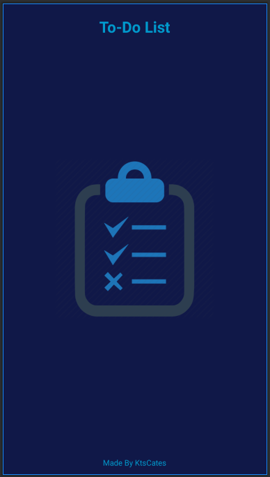
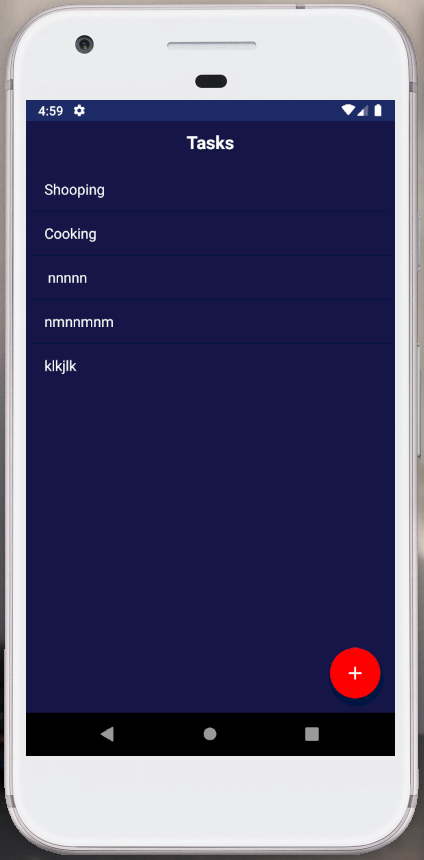
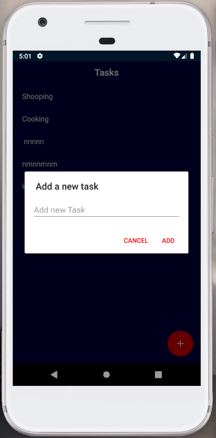

# To-Do-List
GADS 2020

Simple to do list. No database included just adding task and removing them. 

To delete a task long press on the task and it will be removed automatically.

## Screenshots

